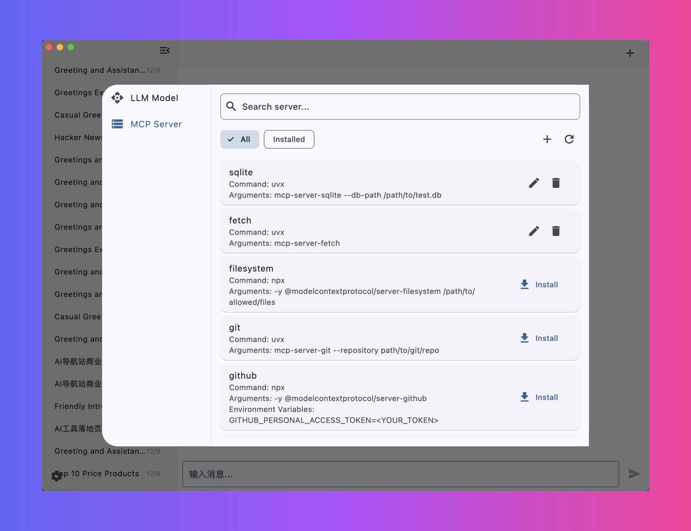

# chatmcp

AI Chat with [MCP](https://modelcontextprotocol.io/introduction) Server use Any LLM Model




## Usage

Make sure you have installed `uvx` or `npx` in your system

1. Configure Your LLM API Key and Endpoint in `Setting` Page
2. Install MCP Server from `MCP Server` Page
3. Chat with MCP Server

## Install

[Download](https://github.com/daodao97/chatmcp/releases)  MacOS | ~Windows~

## Development

```bash
flutter pub get
flutter run -d macos
```

download [test.db](./assets/test.db) to test sqlite mcp server


`~/Documents/mcp_server.json` is the configuration file for the mcp server

## Features

- [x] Chat with MCP Server
- [ ] MCP Server Market
- [ ] Auto install MCP Server
- [ ] SSE MCP Transport Support
- [x] Auto Choose MCP Server
- [x] Chat History
- [x] OpenAI LLM Model
- [ ] Claude LLM Model
- [ ] OLLama LLM Model
- [ ] RAG 
- [ ] Better UI Design

All features are welcome to submit, you can submit your ideas or bugs in [Issues](https://github.com/daodao97/chatmcp/issues)

## MCP Server Market

You can install MCP Server from MCP Server Market, MCP Server Market is a collection of MCP Server, you can use it to chat with different data.

## Thanks

- [MCP](https://modelcontextprotocol.io/introduction)
- [mcp-cli](https://github.com/chrishayuk/mcp-cli)

## License

This project is licensed under the [GNU General Public License v3.0](https://www.gnu.org/licenses/gpl-3.0.en.html) (GPL-3.0).
